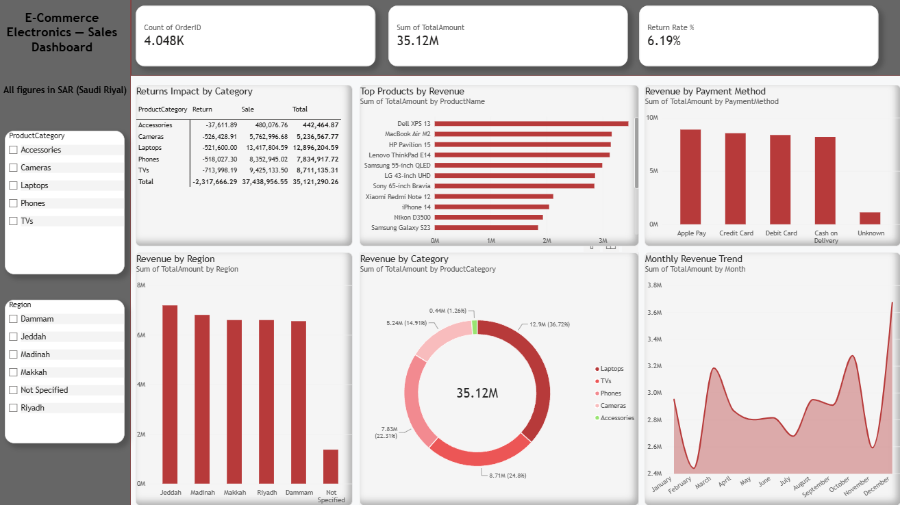

# 📊 E-Commerce Electronics Sales Analytics

A complete data analytics project simulating a real-world messy dataset, covering data cleaning, exploratory data analysis (EDA), and an interactive Power BI dashboard.



---

## 🎯 Project Overview

This project simulates 4,060 e-commerce electronics orders with deliberately injected real-world data quality issues — missing values, duplicates, mixed date formats, inconsistent text, negative quantities (returns), and price outliers. The goal was to practice and demonstrate hands-on data cleaning skills that are essential in real analytics work but often missing from pre-cleaned Kaggle datasets.

**Why synthetic data?** Instead of using a ready-made dataset, the data was generated and intentionally "dirtied" using Python. This allowed full control over exactly which data quality issues exist and why — and made it possible to document each cleaning decision with a clear rationale, just like a real analyst would.

---

## 🧩 The Problem

Raw business data is rarely clean. Before any meaningful analysis can happen, an analyst must:
- Identify data quality issues
- Decide how to handle each one (fix, flag, or interpret as real business signal)
- Validate that cleaning didn't introduce new errors

This project walks through that full process end-to-end.

---

## 🗂️ Dataset

- **Size:** 4,060 rows × 9 original columns (11 after cleaning)
- **Domain:** Electronics e-commerce (Phones, Laptops, TVs, Cameras, Accessories)
- **Time range:** Full year 2024

### Data quality issues intentionally introduced:
| Issue | Description |
|---|---|
| Missing values | `CustomerID`, `PaymentMethod`, `Region` |
| Duplicate rows | Full duplicate order records |
| Mixed date formats | 4 different date formats in `OrderDate` |
| Inconsistent categories | Typos, casing, extra spaces (e.g. `PHONES`, ` phone `, `Tvs`) |
| Negative quantities | Represent product returns |
| Price outliers | Negative prices and extreme values from data entry errors |
| Extra whitespace | Leading/trailing spaces in product names |

---

## 🧹 Data Cleaning Process

Performed in Python (Pandas) inside Google Colab:

1. **Removed exact duplicate rows** (`drop_duplicates`)
2. **Standardized `ProductCategory`** — stripped whitespace, normalized casing, corrected typos via mapping
3. **Unified `OrderDate` formats** — parsed 4 different date formats into a single `datetime64` column
4. **Handled missing values** — filled with meaningful labels (`Guest`, `Unknown`, `Not Specified`) instead of dropping rows
5. **Interpreted negative quantities as returns** — added an `OrderType` column (`Sale` / `Return`) instead of treating them as errors
6. **Fixed price outliers** using category-level median and the IQR method (robust to extreme values)
7. **Cleaned `ProductName` whitespace**
8. Added a calculated **`TotalAmount`** column (Quantity × UnitPrice) to support net revenue analysis

📄 Full step-by-step code with comments: [`Ecommerce_Sales_Analytics_Project.ipynb`](Ecommerce_Sales_Analytics_Project.ipynb)

---

## 📈 Exploratory Data Analysis (EDA)

Key business questions answered using Python (Matplotlib):

1. **Which categories and products generate the most revenue?**
2. **How does revenue trend across the year?**
3. **What is the financial impact of returns on net revenue?**
4. **Which regions perform best?**

### Key Insights
- **Laptops** generate the highest revenue (13.4M SAR) despite having a similar order count to other categories — proving that revenue and order volume tell different stories.
- **Cameras** have the highest return rate (7.6%) among all categories, more than the lowest (Laptops, 4.0%) — a potential signal for product quality or listing accuracy review.
- Returns reduce gross revenue by **6.19%**, from 37.4M SAR (gross) to 35.1M SAR (net) — a meaningful gap that should be tracked in any revenue reporting.
- Revenue is fairly evenly distributed across regions (Jeddah leading by a small margin), suggesting no single dominant market.
- Monthly revenue fluctuations do not show a clear seasonal pattern — consistent with the data being randomly generated, an important distinction between real signal and noise when interpreting synthetic data.

---

## 📊 Power BI Dashboard

An interactive dashboard built on the cleaned dataset, featuring:
- KPI cards (Total Orders, Total Revenue, Return Rate %)
- Monthly revenue trend
- Revenue by category, product, region, and payment method
- Returns impact breakdown by category
- Interactive slicers (Category, Region)

📁 Dashboard file: [`Ecommerce_Sales_Dashboard.pbix`](Ecommerce_Sales_Dashboard.pbix)

---

## 🛠️ Tools & Technologies

- **Python** (Pandas, NumPy, Matplotlib) — data generation, cleaning, and EDA
- **Google Colab** — development environment
- **Power BI Desktop** — interactive dashboard
- **DAX** — custom measures (e.g., Return Rate %)
- **GitHub** — version control and portfolio hosting

---

## 📁 Repository Structure

```
ecommerce-sales-analytics/
│
├── Ecommerce_Sales_Analytics_Project.ipynb   # Full Python notebook (generation, cleaning, EDA)
├── ecommerce_sales_dirty.csv                 # Raw, uncleaned dataset
├── ecommerce_sales_clean.csv                 # Cleaned, analysis-ready dataset
├── Ecommerce_Sales_Dashboard.pbix             # Power BI dashboard file
├── dashboard_screenshot.png                   # Dashboard preview image
└── README.md
```

---

## 🚀 How to Reproduce

1. Clone this repository
2. Open `Ecommerce_Sales_Analytics_Project.ipynb` in Google Colab or Jupyter
3. Run all cells to regenerate the raw dataset, clean it, and reproduce the EDA charts
4. Open `Ecommerce_Sales_Dashboard.pbix` in Power BI Desktop to explore the interactive dashboard

---

*This is a portfolio project using synthetic data designed to demonstrate real-world data cleaning and analysis skills.*
